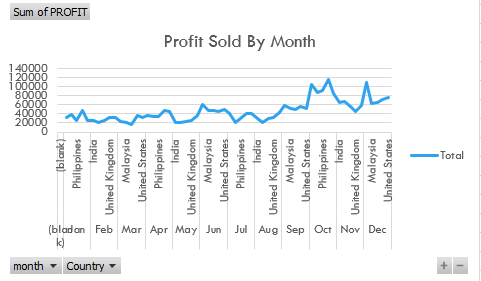
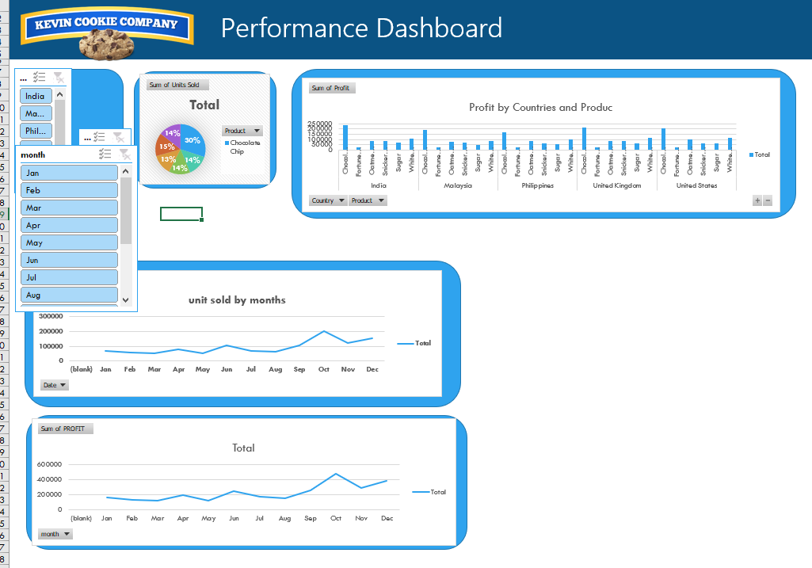

# EXCEL-DASHBORD-FOR-POPRT-
Today we were doing a project and a documentI have made an Exel Document For Kevin Cookie Company, to show how much profit they have made.
I made a pivot table to Merge the new datasheet. Create the profit field, Profit = Revenue-Cost then Create a pivot table for “Profit by Months” and a corresponding chart or graph.
I also created a pivot table for “Unit Sold by Months” and a corresponding chart or graph. Then I created a pivot table for “Unit Sold by Products” and a corresponding chart or graph. 
Create a pivot table for “Profit by Countries and Products ” and a corresponding chart or graph. I Created a Dashboard and designed and customized my dashboard, then I Created three slicers.
 

